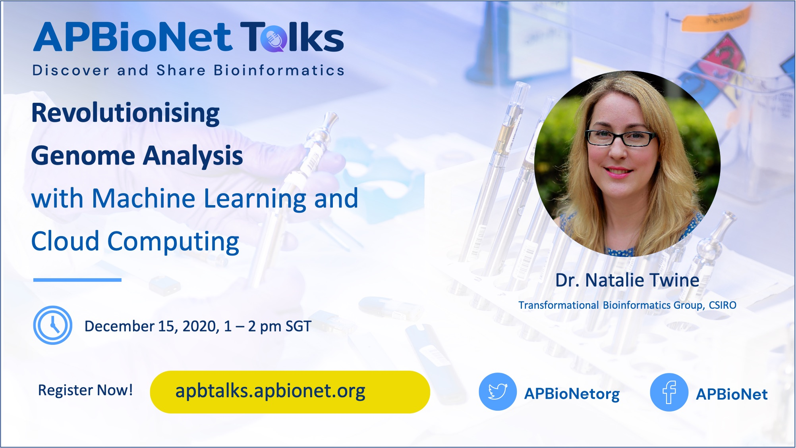

# Revolutionising genome analysis with machine learning and cloud computing
***Dr. Natalie Twine, Transformational Bioinformatics Group, CSIRO*** 

**Highlight:**
APBioNETTalks was inaugurated on 15th December 2020 (Monday), featuring our first speaker Dr. Natalie Twine from Transformational Bioinformatics Group, CSIRO. The talk started with opening remarks by one of the founders of APBioNet, Assoc. Prof. Tan Tin Wee from the National University of Singapore (NUS). He highlighted the need to spread bioinformatics throughout the Asia Pacific region and beyond, and was pleased to see the younger generation driving the current initiatives of APBioNet, something which is much needed for sustainability.

The sessions continued with our first APBioNetTalks entitled “Revolutionising genome analysis with machine learning and cloud computing”. Dr Twine provided an insider’s view into the development of a Spark-based machine learning framework that is able to find disease genes among the three billion letters of the human genome. She also covered a new software, TRIBES, developed to uncover distant relatedness in genomic data. Knowing relationship status is important for diagnosing and treating genetic diseases. Dr. Twine showcased how technology has been used to understand and find treatments for motor neurone disease. Finally, she showcased hot-off-the-press cloud-native technology, where CSIRO has advanced the response to COVID-19 through digital health.

You can view the full talk on our YouTube channel: [https://www.youtube.com/watch?v=AQrXVbVD-9s](https://www.youtube.com/watch?v=AQrXVbVD-9s)

[To the main README >](https://github.com/APBioNet/APBioNetTalks)