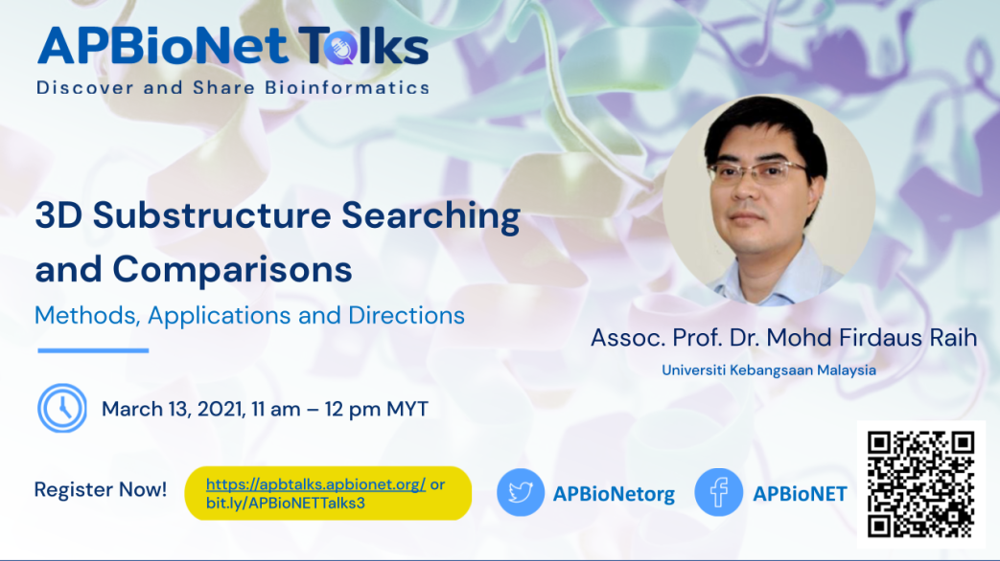

# 3D substructure searching and comparisons: methods, applications and directions
***Assoc. Prof. Dr. Mohd Firdaus Raih, Universiti Kebangsaan Malaysia***

**Highlight:**
The third APBioNETTalks held on March 13, 2021 was presented by Assoc. Prof. Dr. Mohd Firdaus Raih of Universiti Kebangsaan Malaysia. The talk entitled “3D substructure searching and comparisons: methods, applications and directions” showcased the importance of comparing the substructure similarity of proteins and RNA molecules. Dr Firdaus and his team developed several tools to allow analysis of the PDB structure to annotate and characterise substructure similarities in known proteins. He categorically highlighted the advantage of using graph theory concepts and their applications in unraveling the “gems” hidden in the protein's structure. His talk emphasised the application of substructure study in areas of drug repositioning in cancer and infectious diseases, novel motif prediction, and modeling evolutionary trajectories.

If you missed the talk, you can rewatch it here: [https://youtu.be/cs6xf-98kj0](https://youtu.be/cs6xf-98kj0)

[To the main README >](https://github.com/APBioNet/APBioNetTalks)