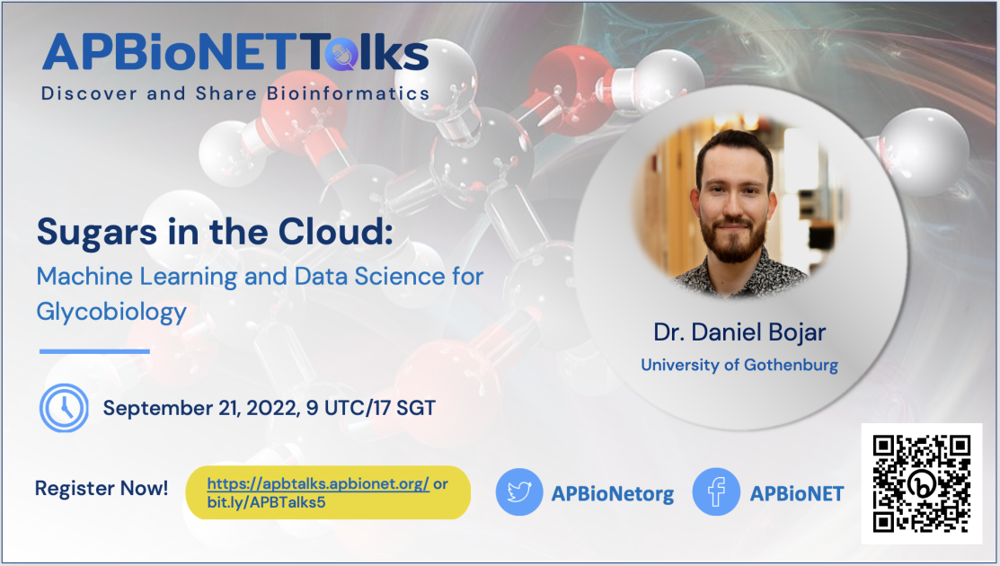

# Sugars in the cloud: Machine learning and data science for glycobiology
***Dr. Daniel Bojar, University of Gothenburg, Sweden*** 

**Highlight:**
Our fifth APBioNETTalks took place on September 21, 2022, entitled “Sugars in the Cloud: Machine Learning and Data Science for Glycobiology” and was delivered by  Dr. Daniel Bojar of the University of Gothenburg. The talk of Dr. Daniel Bojar brought out the importance of glycans and their vital function in various cellular activities. He shared on glycan-binding proteins (Lectin) and discussed the state-of-the-art deep learning approaches in glycoinformatics. A centralized source software repository, Glycoinformatics Consortium (GLIC), has been created to serve as a communication hub for glycoscientists and glycoinformaticians (https://glic.glycoinfo.org/).

You can view the full talk on our YouTube channel: [https://www.youtube.com/watch?v=hUs7X3laUhM](https://www.youtube.com/watch?v=hUs7X3laUhM)

[To the main README >](https://github.com/APBioNet/APBioNetTalks)
