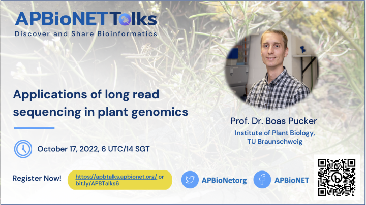

# Applications of long read sequencing in plant genomics
***Prof. Dr. Boas Pucker, Institute of Plant Biology, TU Braunschweig, Germany*** 

**Highlight:**

You can view the full talk on our YouTube channel: 

[To the main README >](https://github.com/APBioNet/APBioNetTalks)
