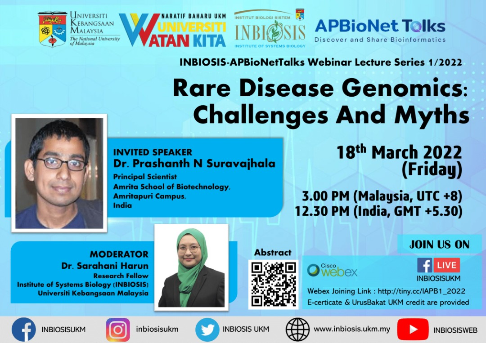

# Rare disease genomics: Challenges and myths
***Dr. Prashanth N. Suravajhala, Amrita School of Biotechnology, India***

**Abstract:**
Systems Genomics has transcended from its native functional genomics to validation biology in its own vivid ways. Thanks to next-generation sequencing (NGS) approaches, there arose a need to develop several pipelines to infer pathogenic mutations. However, for inferring rare diseases, the chance of identifying pathogenic spectrum varies and would be a difficult conundrum in establishing de novo heterozygous missense variants. Furthermore, the discovery of variants of unknown significance (VUS) could provide insights into the rare disease manifestation and its etiology. The variants are further validated for revealing disease-causing mutations which could close the gaps of surgery by bringing intervention in therapies. Whole Exome Sequencing (WES) has been an invaluable and cost-effective approach to identify genetic variants responsible for both Mendelian and polygenic diseases. In the recent past, it has allowed detecting clinically relevant genomic regions spanning the known unknown regions, disease-associated sites and untranslated regions (UTRs). In addition to the well-known diseases, prenatal abnormalities, structural anomalies and congenital defects were studied demonstrating a good diagnostic yield. While WES approaches are abundant, they are limited if the disease in question is characteristically rare and medically inconclusive. This could be a deterrent because of the challenges in variant discovery, including rare and low-frequency mutations using next-generation sequencing (NGS) technologies. Recent decrease in cost of WES and accuracy of the NGS has enabled the researchers to study a large number of WES samples but in case of rare diseases, studying exome-trios (proband/parents) or quad, with an addition of sibling to discover single nucleotide variations (SNVs). The talk would delve upon myths, misconceptions and facts from our case studies.

The talk is available for later viewing, in case you could not attend the talk or would like to revisit or share it with others: [https://youtu.be/IPUMV63MWz8](https://youtu.be/IPUMV63MWz8).

[To the main README >](https://github.com/APBioNet/APBioNetTalks)
