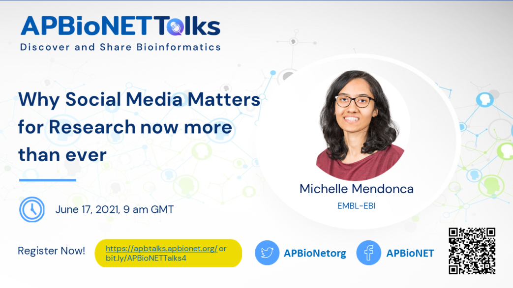
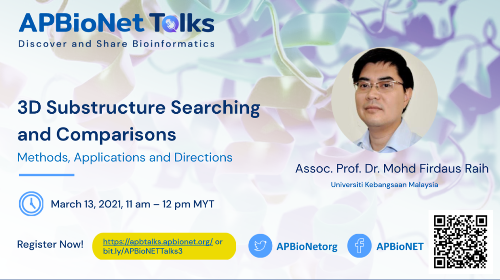

 

## **Welcome to APBioNetTalks!** 
This is a community initiative brought to you by Asia-Pacific Bioinformatics Network (APBioNet). It aims to provide an online avenue to showcase bioinformatics related talks, tutorials, and training. The program aims to make the learning of bioinformatics more engaging, inclusive and accessible. We will invite experts, early career researchers/scientists, and Ph.D. students to share their knowledge and skills. If you are interested to contribute, do get in touch with us. The videos will be live-streamed and be made available for later viewing. This materials will serve as an open bioinformatics resource for the community. In the process, we hope to promote the discovery and sharing of bioinformatics. Video-based learning resources for bioinformatics are still scarce. Some of them are not available in English. If available, they are not free. Even if they are free, they usually only cover the introduction aspects, with very basic discussions. Most of the specific and intermediate-to-advanced discussions or skills are usually not available. This hampers the learning of bioinformatics in solving complex biological problems. Through APBioNetTalks, we hope to contribute to bridge this gap by providing an open access video-based bioinformatics learning resources for the community.

Table of Contents
====================
- [How to Get Involved](#how-to-get-involved)
- [Upcoming Activities](#upcoming-activities)
    + [Why social media matters for research now more than ever by *Michelle Mendonca*](#why-social-media-matters-for-research-now-more-than-ever)
- [Past Activities](#past-activities)
    + [Revolutionising genome analysis with machine learning and cloud computing by *Dr Natalie Twine*](#revolutionising-genome-analysis-with-machine-learning-and-cloud-computing)
    + [Structural phylogenetics (Demo Talk) by *Dr Ashar Malik*](#structural-phylogenetics)
    + [3D substructure searching and comparisons: methods, applications and directions by *Assoc. Prof. Dr. Mohd Firdaus Raih*](#3d-substructure-searching-and-comparisons-methods-applications-and-directions)
- [Contributors](#contributors)

## **How to Get Involved** 
**Let us know what you think:** share your thoughts on our services via [email](secretariat@apbionet.org), [Twitter](https://twitter.com/APBioNetorg) or [Facebook](https://web.facebook.com/apbionet). 

**Become a supporting member:** be a part of Asia Pacific bioinformatics community. Find out more about us on our [website](http://www.apbionet.org/). 

**Speaker:** if you are passionate about sharing the latest developments and/or know-how in your area of expertise to the community, we welcome you to contribute a talk/demo/tutorial/workshop to APBioNetTalks. Please help complete this [form](https://bit.ly/APBioNetTalksForm2), which would capture all the relevant information we need. You can make multiple submissions if you are keen to contribute more. 

**Moderator:** If you are interested in being a moderator for a talk/demo/workshop according to your areas of interest or expertise, please fill this [form](https://bit.ly/APBioNetTalksForm2). 

**Organising or Scientific committee members:** Join our team to bring inclusive and open-access learning avenue for scientific community. Note that this is a pro bono. With your support, we hope we can continuously provide inclusive and accessible contents for you. We believe that open science will make research more reproducible, more transparent and more collaborative. Apply [here](https://bit.ly/APBioNetTalksForm2). 

We are committed to providing a welcoming and inspiring platform for all. Please follow our [code of conduct](https://apbtalks.apbionet.org/code-of-conduct/) in all kind of activities related to APBioNetTalks.

## *Upcoming Activities*

### Why social media matters for research now more than ever
**June 17, 2021, 9am (GMT)**

***Michelle Mendonca, EMBL-EBI***

In this session, you will hear from Michelle on the increasing demand for researchers to build a digital presence with the onset of the COVID-19 pandemic and the role of social media in science communication. She will also cover examples of scientific organisations using innovative approaches to promote their research using social media, with insights on how BioExcel Centre of Excellence harnessed Twitter to build a successful computational biomolecular research community. Michelle will cover how to optimize your use of social media platforms along with “dos and don’ts” of building a digital presence. 

**Bio:**
Michelle is the Digital Strategy Officer at EMBL-EBI, where she is responsible for driving social strategy and content creation for European Commission funded projects such as BioExcel and CINECA. In her role, Michelle combines her background in science and her passion for storytelling to develop effective social media campaigns. Driven by data, Michelle is always tracking the latest trends, while ensuring the standard practice of accessibility is followed across digital platforms. Along with social media, Michelle also organises scientific courses and conferences at EMBL-EBI. Michelle holds a Master’s degree in Biotechnology from The University of Melbourne.

[Register for this talk now!](https://bit.ly/APBioNETTalks4)

## *Past Activities*

### Revolutionising genome analysis with machine learning and cloud computing
***Dr. Natalie Twine, Transformational Bioinformatics Group, CSIRO*** 

**Highlight:**

APBioNetTalks was inaugurated on 15th December 2020 (Monday), featuring our first speaker Dr. Natalie Twine from Transformational Bioinformatics Group, CSIRO. The talk started with opening remarks by one of the founders of APBioNet, Assoc. Prof. Tan Tin Wee from the National University of Singapore (NUS). He highlighted the need to spread bioinformatics throughout the Asia Pacific region and beyond, and was pleased to see the younger generation driving the current initiatives of APBioNet, something which is much needed for sustainability.

The sessions continued with our first APBioNetTalks entitled “Revolutionising genome analysis with machine learning and cloud computing”. Dr Twine provided an insider’s view into the development of a Spark-based machine learning framework that is able to find disease genes among the three billion letters of the human genome. She also covered a new software, TRIBES, developed to uncover distant relatedness in genomic data. Knowing relationship status is important for diagnosing and treating genetic diseases. Dr. Twine showcased how technology has been used to understand and find treatments for motor neurone disease. Finally, she showcased hot-off-the-press cloud-native technology, where CSIRO has advanced the response to COVID-19 through digital health.

You can view the full talk on our YouTube channel: [https://www.youtube.com/watch?v=AQrXVbVD-9s](https://www.youtube.com/watch?v=AQrXVbVD-9s)

### Structural phylogenetics
***Dr. Ashar Malik, Bioinformatics Institute, A*STAR, Singapore**

**Highlight:**
Our second APBioNETTalks, which was a demo, took place on January 9, 2021 entitled “Structural Phylogenetics” and was delivered by Dr. Ashar Malik of Bioinformatics Institute, A*STAR, Singapore.

The session provided a comprehensive yet accessible overview on sequence and structural phylogenetics. Dr. Ashar covered various topics under the theme, including pipelines and tools to use for performing evolutionary analysis, different kinds of statistical methods and phylogenetic tree generation approaches. He also provided a quick demo on how to utilize the command line interface for structure and sequence comparisons, as well as for tree generation.

The talk was live-streamed on APBioNET YouTube channel and is also available for later viewing, in case you could not attend the talk or would like to revisit or share it with others: [https://youtu.be/yQZA47jiI3s](https://youtu.be/yQZA47jiI3s)

Do subscribe to be notified on future talks.

### 3D substructure searching and comparisons: methods, applications and directions
***Assoc. Prof. Dr. Mohd Firdaus Raih, Universiti Kebangsaan Malaysia***

**Highlight:**
The third APBioNETTalks held on March 13, 2021 was presented by Assoc. Prof. Dr. Mohd Firdaus Raih of Universiti Kebangsaan Malaysia. The talk entitled “3D substructure searching and comparisons: methods, applications and directions” showcased the importance of comparing the substructure similarity of proteins and RNA molecules. Dr Firdaus and his team developed several tools to allow analysis of the PDB structure to annotate and characterise substructure similarities in known proteins. He categorically highlighted the advantage of using graph theory concepts and their applications in unraveling the “gems” hidden in the protein's structure. His talk emphasised the application of substructure study in areas of drug repositioning in cancer and infectious diseases, novel motif prediction, and modeling evolutionary trajectories.

If you missed the talk, you can rewatch it here: [https://youtu.be/cs6xf-98kj0](https://youtu.be/cs6xf-98kj0)

Do subscribe to our YouTube channel and APBioNET newsletter in order to not miss upcoming APBioNET events.

## *Contributors*
**Creator:** 
- Hilyatuz Zahroh
- Mohammad Asif Khan

**Program coordinator (2020-present):**
Hilyatuz Zahroh

**Scientific Committee:**
Mohammad Asif Khan

**Recurring Contributors:**
- Li Chuin Chong
- Debangana Chakravorty 
- Deeksha Pandey
- Rizkyana Avissa
- Sharanya Manoharan
- More to come..
