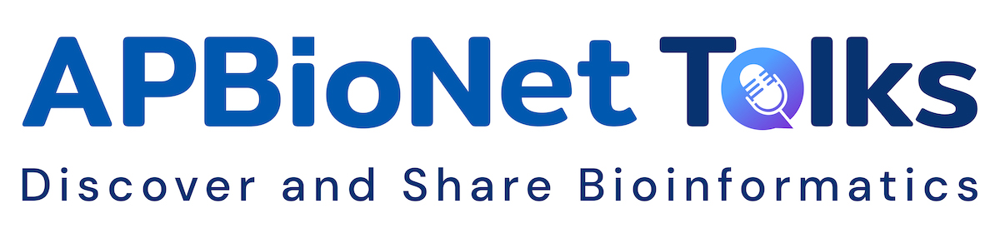
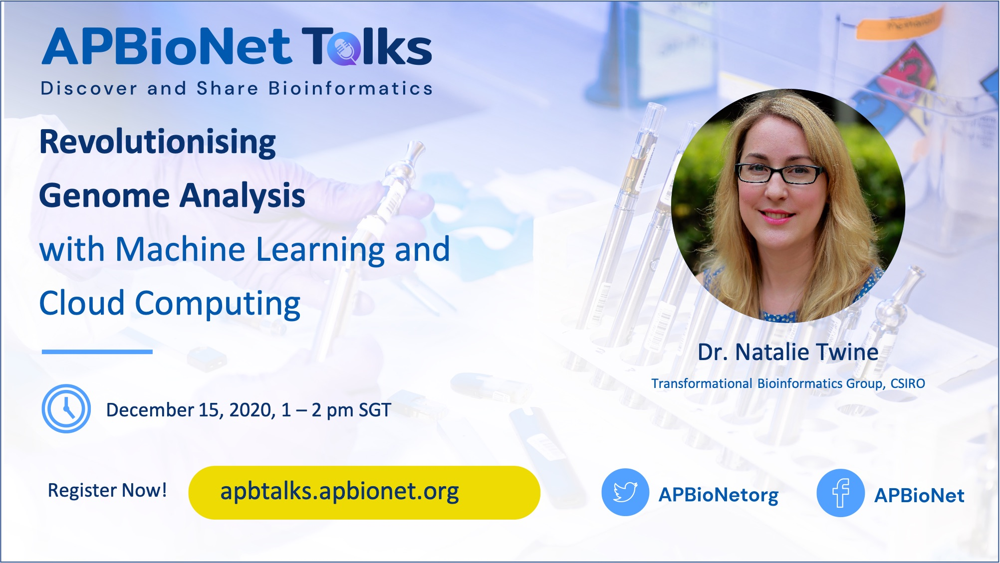

 

## **Welcome to APBioNetTalks!** 
This is a community initiative brought to you by Asia-Pacific Bioinformatics Network (APBioNet). It aims to provide an online avenue to showcase bioinformatics related talks, tutorials, and training. The program aims to make the learning of bioinformatics more engaging, inclusive and accessible. We will invite experts, early career researchers/scientists, and Ph.D. students to share their knowledge and skills. If you are interested to contribute, do get in touch with us. The videos will be live-streamed and be made available for later viewing. This materials will serve as an open bioinformatics resource for the community. In the process, we hope to promote the discovery and sharing of bioinformatics. Video-based learning resources for bioinformatics are still scarce. Some of them are not available in English. If available, they are not free. Even if they are free, they usually only cover the introduction aspects, with very basic discussions. Most of the specific and intermediate-to-advanced discussions or skills are usually not available. This hampers the learning of bioinformatics in solving complex biological problems. Through APBioNetTalks, we hope to contribute to bridge this gap by providing an open access video-based bioinformatics learning resources for the community.

Table of Contents
====================
- [How to Get Involved](#how-to-get-involved)
- [Upcoming Activities](#upcoming-activities)
    + [Structural phylogenetics (Demo Talk) by *Dr Ashar Malik*](#structural-phylogenetics)
- [Past Activities](#past-activities)
    + [Revolutionising genome analysis with machine learning and cloud computing by *Dr Natalie Twine*](#revolutionising-genome-analysis-with-machine-learning-and-cloud-computing)
- [Contributors](#contributors)

## **How to Get Involved** 
**Let us know what you think:** share your thoughts on our services via [email](secretariat@apbionet.org), [Twitter](https://twitter.com/APBioNetorg) or [Facebook](https://web.facebook.com/apbionet). 

**Become a supporting member:** be a part of Asia Pacific bioinformatics community. Find out more about us on our [website](http://www.apbionet.org/). 

**Speaker:** if you are passionate about sharing the latest developments and/or know-how in your area of expertise to the community, we welcome you to contribute a talk/demo/tutorial/workshop to APBioNetTalks. Please help complete this [form](https://bit.ly/APBioNetTalksForm2), which would capture all the relevant information we need. You can make multiple submissions if you are keen to contribute more. 

**Moderator:** If you are interested in being a moderator for a talk/demo/workshop according to your areas of interest or expertise, please fill this [form](https://bit.ly/APBioNetTalksForm2). 

**Organising or Scientific committee members:** Join our team to bring inclusive and open access learning avenue for scientific community. Note that this is a pro bono. With your support, we hope we can continuously provide inclusive and accessible contents for you. We believe that open science will make research more reproducible, more transparent and more collaborative. Apply [here](https://bit.ly/APBioNetTalksForm2). 

We are committed to providing a welcoming and inspiring platform for all. Please follow our [code of conduct](https://apbtalks.apbionet.org/code-of-conduct/) in all kind of activities related to APBioNetTalks.

## *Upcoming Activities*

### Structural phylogenetics
**January 9, 2021, 11 am - 1 pm SGT**

***Dr. Ashar Malik, Bioinformatics Institute, A*STAR, Singapore***

The primary step in the process of characterising a novel protein sequence is by comparison with those already characterised. Similarity based functional characterisation and determination of an evolutionary origin can become a non-trivial problem for significantly diverged proteins. Protein structure, on the other hand, is considered to be conserved over longer evolutionary timescales. An evolutionary signal lost from the sequence may therefore still be retained within the conserved structure. Current times are seeing an exponential growth in protein structural data, presenting a unique opportunity to explore deep evolutionary questions. However a poor understanding of protein structural evolution prevents usage of classical sequence-based phylogenetic methods. Empirical distance-based methods have been employed, however the lack of a method to gauge the robustness of evolutionary relationships inferred limits their traction. A novel molecular dynamics-based bootstrap approach is presented which allows for the quantitative assessment of evolutionary relationships inferred from protein structural phylogenies. The novel ability to associate a measure of robustness with inferences allows protein structure-based phylogenies to uncover answers to deep evolutionary questions. In this talk sequence and structure-based phylogenetic methods will be looked at and (time permitting) a demonstration of structure-based phylogenetic analysis will be carried out. 

**Bio:**
Dr. Ashar completed his PhD in Computational Biochemistry from Massey University in 2018 where he developed the method to recover evolutionary information from protein structures. Currently, he is a postdoctoral research fellow at the Bioinformatics Institute, Agency for Science, Technology and Research (A*STAR) in Singapore. His current work focuses on developing tools for the annotation of variations in the human genome.

[Register for this talk now!](https://bit.ly/apbionettalks2)

## *Past Activities*

### Revolutionising genome analysis with machine learning and cloud computing
***Dr. Natalie Twine, Transformational Bioinformatics Group, CSIRO*** 

**Highlight:**

APBioNetTalks was inaugurated  on 15th December 2020 (Monday), featuring our first speaker Dr. Natalie Twine from Transformational Bioinformatics Group, CSIRO. The talk started  with opening remarks by one of the founders of APBioNet, Assoc. Prof. Tan Tin Wee from the National University of Singapore (NUS). He highlighted the need to spread bioinformatics throughout the Asia Pacific region and beyond, and was pleased to see the younger generation driving the current initiatives of APBioNet, something which is much needed for sustainability.

The sessions continued with our first APBioNetTalks entitled “Revolutionising genome analysis with machine learning and cloud computing”. Dr Twine provided an insider’s view into the development of a Spark-based machine learning framework that is able to find disease genes among the three billion letters of the human genome. She also covered a new software, TRIBES, developed to uncover distant relatedness in genomic data. Knowing relationship status is important for diagnosing and treating genetic diseases. Dr. Twine showcased how technology has been used to understand and find treatments for motor neurone disease. Finally, she showcased hot-off-the-press cloud-native technology, where CSIRO has advanced the response to COVID-19 through digital health.

You can view the full talk on our YouTube channel: https://www.youtube.com/watch?v=AQrXVbVD-9s

Do subscribe to be notified on future talks.

## *Contributors*
**Creator:** 
- Hilyatuz Zahroh
- Mohammad Asif Khan

**Program coordinator (2020-present):**
Hilyatuz Zahroh

**Scientific Committee:**
Mohammad Asif Khan

**Recurring Contributors:**
- Li Chuin Chong
- Debangana Chakravorty 
- Deeksha Pandey
- Rizkyana Avissa
- Sharanya Manoharan
- More to come..
